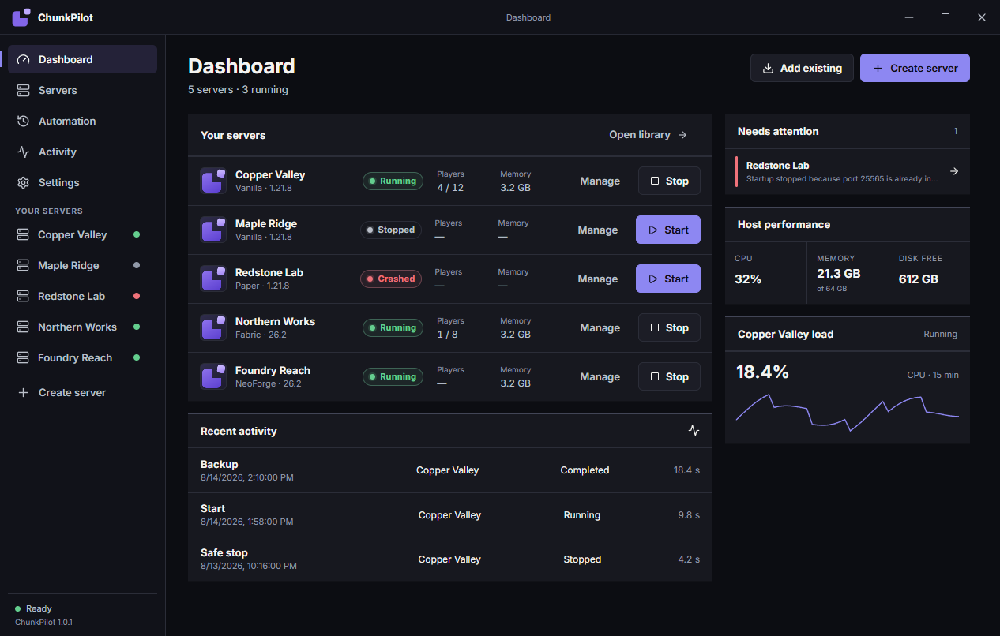
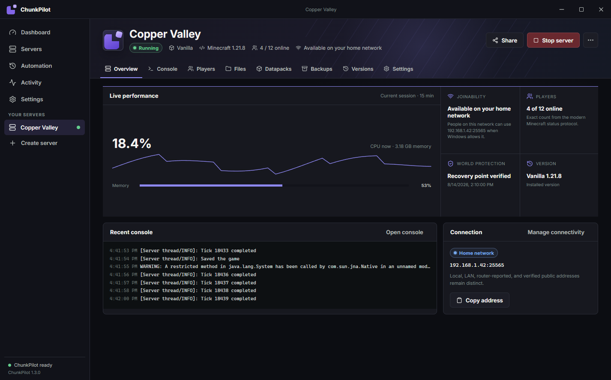
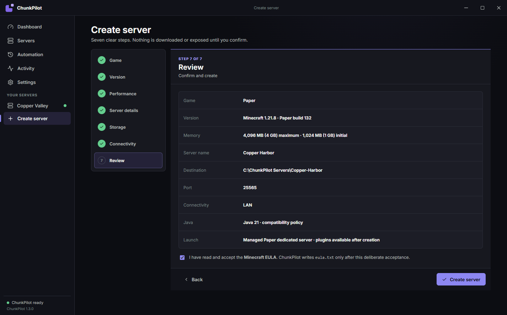

<p align="center">
  
</p>

# ChunkPilot

ChunkPilot is a local-first Windows app for creating and managing Minecraft servers without making users learn Java installations, JAR layouts, launch scripts, or router terminology. The native desktop app talks to a separate per-user Agent over a current-user-only named pipe; that Agent owns server processes, console streams, lifecycle operations, transactional installs and updates, managed Java, backups, schedules, and recovery.

> **Pre-alpha:** `v1.3.0-alpha.2` is the first public snapshot. It is a frozen upgrade-test baseline, not a stable or beta release.

[Download the Windows prerelease](https://github.com/Wngartman/ChunkPilot/releases/tag/v1.3.0-alpha.2) · [Report a bug](https://github.com/Wngartman/ChunkPilot/issues/new?template=bug_report.yml) · [Security policy](SECURITY.md)

## Download and install

ChunkPilot currently targets 64-bit Windows 10 and Windows 11.

For a normal install, open [Releases](https://github.com/Wngartman/ChunkPilot/releases) and download **`ChunkPilot-Setup-v1.3.0-alpha.2.exe`**. It is a per-user installer for `%LOCALAPPDATA%\Programs\ChunkPilot` and includes the .NET 10 runtime; users do not need to install .NET or Node.js. If WebView2 is absent, setup runs the bundled Microsoft-signed Evergreen bootstrapper.

The Start Menu contains two explicit entries:

- **ChunkPilot** opens the current accepted WPF interface.
- **ChunkPilot WebUI Preview** opens the opt-in preview with `--webui-preview`.

The installer and application binaries are currently unsigned. Windows SmartScreen may warn; SHA-256 verifies download integrity but does not prevent reputation warnings.

### Portable

Download **`ChunkPilot-Portable-v1.3.0-alpha.2-win-x64.zip`**, verify it against `SHA256SUMS.txt`, extract the entire archive, and run `ChunkPilot.exe`. Keep the `Agent` directory beside the executable. To open the preview interface:

```powershell
.\ChunkPilot.exe --webui-preview
```

The portable package needs no installer or developer tools. Its WebUI preview requires the Microsoft Edge WebView2 Evergreen Runtime; the default WPF interface does not.

## Screenshots

All screenshots below come from deterministic, invented fixture data. They contain no real server names, addresses, worlds, logs, usernames, or local paths.

| Dashboard | Running server | Guided creation |
| --- | --- | --- |
|  |  |  |

## Privacy and data locations

ChunkPilot has no account system, ads, or telemetry. Application state remains local. Provider metadata, downloads, and an explicitly requested external reachability check contact only the service required for that workflow.

ChunkPilot stores its database, recovery files, logs, caches, shares, and default backups under `%LOCALAPPDATA%\ChunkPilot`. Managed Minecraft instances default to `%USERPROFILE%\ChunkPilot\Servers`, outside the application binary directory. Imported servers remain in their original locations.

Default uninstall removes binaries, shortcuts, and uninstall registration while preserving settings, protected provider credentials, imported servers, managed servers, worlds, backups, schedules, and history. Optional data-removal choices are separate and unchecked by default.

## Add or install a server

**Add Existing Server** performs a bounded read-only scan, ranks launch candidates as Recommended, Alternative, or Manual configuration required, and registers the selected folder by reference. It never moves or rewrites the imported server during detection.

**Create Server** starts with Vanilla With Friends, Faster Vanilla, Modpack, Plugins and Minigames, Java/Bedrock Crossplay guidance, Bedrock, Import, or Advanced. It creates a managed instance transactionally from:

- Vanilla release metadata and server JARs.
- Stable Paper builds.
- Purpur builds.
- Official Fabric server launchers.
- Official Quilt installers.
- Official Forge installers.
- Official NeoForge installers.
- Exact server-capable Modrinth catalog releases.
- CurseForge server packs when the user configures an official API key.
- Local ZIP or JAR.
- Direct HTTPS ZIP or JAR, with an explicit warning required for HTTP.
- An existing local package folder.

The installer downloads or copies into same-volume staging, blocks ZIP path traversal, verifies published hashes, runs loader installers through an absolute Java path with captured output, detects non-detaching argument files, writes `eula=true` only after the user checks the EULA box, validates the result, and atomically promotes it into the final instance folder. When an installer needs newer Java than its Minecraft server, ChunkPilot uses a separate private installer runtime and preserves the server's exact runtime assignment. A failed install is never registered as usable.

Private managed Java uses checksum-verified Eclipse Temurin x64 JRE archives under `%LOCALAPPDATA%\ChunkPilot\ManagedJava`. It never changes PATH, JAVA_HOME, Program Files, or system Java.

## Server-pack updates and versions

The Overview update card and per-server **Version Manager** operate on complete server-pack releases, never an uncontrolled list of individual mod updates. A source must be proven from trusted metadata or linked explicitly with an installed baseline before ChunkPilot offers an update.

Provider adapters use Modrinth project versions, the official CurseForge API, published GitHub Releases, an HTTPS direct version manifest, or local package history. Modrinth selects a server ZIP/JAR asset rather than a client `.mrpack`. CurseForge requires a user API key encrypted with Windows DPAPI and a release that exposes an official server-pack file. GitHub ignores drafts, treats prereleases as beta, verifies an asset digest when present, and otherwise records a locally calculated SHA-256.

An install warns players, saves, stops the full process tree, creates and verifies a compressed full snapshot including worlds, downloads to cache, verifies the strongest provider hash, safely extracts into a sibling candidate, classifies persistent versus pack-managed files, records migration decisions, validates a controllable launch candidate, and switches directories atomically. It then requires both console readiness and a local Minecraft status response. Failed startup stops the candidate, restores and verifies the prior snapshot, and restarts the old version when it had been running.

The active update remains **Pending validation** until the user marks it healthy. Old snapshots can be retained permanently or for 7/30 days, verified, exported as records, activated, or removed. Removal moves only the named snapshot archive and manifest into ChunkPilot Recovery; active installations, separately managed worlds, and the last usable version are protected.

Automatic checks default to daily and contact only the linked provider. Automatic installation is off by default. Optional unattended installation is limited to stable, compatible releases during a maintenance window, with no known migration warning or online players, one attempt per target version, a verified conventional backup, a verified rollback snapshot, and automatic failed-startup rollback.

The compact global **Updates** page lists available releases, pending validation, failures, and rollback state without duplicating the per-server Version Manager.

## Lifecycle and console

Supported server launch profiles receive exactly one `nogui` argument. ChunkPilot continues to use redirected stdin/stdout/stderr with `UseShellExecute=false` and `CreateNoWindow=true`; it does not use `javaw.exe` or post-launch window hiding. Startup shows the final executable, arguments, and working directory. Detaching scripts that invoke `start` or `javaw` are reported because they cannot provide reliable console ownership.

Start, Save, Stop, Restart, Backup, Restore, world changes, exports, and jar changes are serialized by the agent. Stop and Restart wait for save confirmation and process-tree exit. A timeout never silently force-terminates a server.

Normal UI close is immediate and non-modal: the window sends `SafeApplicationExit`, removes its tray icon, and exits while the agent saves/stops managed servers. Exact UI-process death, including a crash or forced UI termination, triggers the same fail-closed server shutdown; pipe disconnect alone does not. Minimize/tray keeps hosting. Public-connectivity generations are revoked before slow shutdown work, a replacement UI must wait for the next Agent and explicitly re-enable Direct internet, and the Agent remains alive if a known managed process cannot yet be proven stopped. Manual stop invalidates pending crash recovery. Newly managed process identity uses PID plus exact raw Windows creation time and executable provenance; legacy records without exact identity are never automatic kill authority.

The virtualized console follows output while its viewport is at the bottom, pauses when the user scrolls up, counts unseen lines, and resumes through **Jump to latest** or command submission. Filters cover Info, Warning, Error, and Chat; search and visible-only clearing do not alter log files.

## Worlds, icons, whitelist, and jars

The Worlds tab detects the active `level-name`, lists world folders with `level.dat`, imports nested ZIPs through safe extraction, switches only while stopped, and never deletes the previous world. Live export uses `save-off`, `save-all flush`, verified ZIP creation, and `save-on` in a `finally` path. The exported ZIP includes a hash manifest and is placed on the Windows clipboard as a file-drop item.

Server icon upload accepts formats supported by ImageSharp and writes an atomic, centered 64x64 `server-icon.png`, preserving transparency and copying the previous icon into Recovery.

The Access Control Center reconciles whitelist, operators, player bans, IP bans, reasons, expiration, UUIDs, and user-cache evidence. Live changes use authoritative server commands. While stopped, ChunkPilot validates and atomically writes supported JSON files with recovery copies. It never invents UUIDs.

The Mods or Plugins page follows the detected ecosystem. Local JAR installation is stopped-server only, checks hashes and duplicate IDs, reports Compatible/Likely compatible/Incompatible/Unknown rather than percentages, and creates recovery data on replacement. Disabled jars move outside the active loader directory into `.chunkpilot-disabled`.

The Packs page validates `pack.mcmeta` against the selected Minecraft version, associates a datapack with one real world, backs up before installation or replacement, reloads a running server, and records the installed hash. Server resource-pack settings require a real HTTPS URL and a 40-character SHA-1; ChunkPilot can calculate SHA-1 from a local ZIP but never claims to host or expose that file.

## RAM, addresses, and schedules

Startup provides constrained Xms/Xmx controls, host-aware recommendations, aggregate allocation warnings, and safe updates to `user_jvm_args.txt` or app-managed direct Java arguments. Complex scripts are not blindly rewritten and prior content is recoverable.

Each server shows local, LAN, and configured public addresses. Connection Test reports process state, local listening, local Minecraft handshake, firewall assessment availability, LAN availability, configured public address, and the separate result of an optional external probe. A local socket never proves public reachability.

Automatic restarts support a player countdown, optional backup, save, full stop, delay, background start, readiness wait, and bounded retry behavior. The same per-server operation lock prevents overlap with backup, restore, world, and jar operations.

## Backups and restore

Backups stream into ZIP archives and include a SHA-256 manifest. Destination-inside-source and ZIP path traversal are rejected. Restore runs only while stopped, requires confirmation, creates a pre-restore safety backup, stages replacements, and preserves unrelated files.

The default uninstaller removes only binaries, shortcuts, and startup registration. Settings/history, caches/staging/shares, and logs are optional. Managed instances and backup archives have separate danger-labeled checkboxes that are unchecked by default. Imported external servers are never offered for deletion.

## Build, test, and publish

The repository pins .NET SDK 10.0.302 and will use `.tools\dotnet\dotnet.exe` when present.

```powershell
.\scripts\build.ps1
.\scripts\test.ps1
.\scripts\publish.ps1
.\scripts\publish.ps1 -BuildInstaller -ReleaseTag v1.3.0-alpha.2
.\scripts\package-release.ps1 -ReleaseTag v1.3.0-alpha.2
.\scripts\test-packaged-ui-close.ps1 -PortableRoot .\artifacts\portable-test
```

The publish script restores, runs the complete test suite, produces all three release layouts, generates third-party notices, and optionally invokes repository-local Inno Setup 7. The package script produces the consumer ZIP, checksums, SPDX SBOM, and exact release notes. A failed check stops publication. See [release instructions](docs/RELEASING.md).

`test-packaged-ui-close.ps1` is a bounded packaged-WPF lifecycle smoke test. It requires a current portable layout, creates unique temporary `CHUNKPILOT_DATA_ROOT` values and unique Agent instance IDs, launches only the portable App plus synthetic isolated Agents, then uses the normal Windows `WM_CLOSE` path (`Process.CloseMainWindow`) to close the App. It verifies the App exit, the intended Agent's safe-close shutdown, and survival of a separately isolated Agent before cleaning only script-owned processes and temporary roots. It never launches a Minecraft server or uses a real server, installed ChunkPilot instance, AppData, ProgramData, or user-managed data. It does not test installer upgrade/rollback behavior or non-interactive desktop environments.

## Troubleshooting

- **Agent does not connect:** keep `Agent\ChunkPilot.Agent.exe` beside the app and reopen ChunkPilot. The UI reconnects to the matching per-user agent.
- **Server GUI appears or console is empty:** review Startup. Use a supported non-detaching profile; scripts using `start` or `javaw` cannot retain console ownership.
- **Server does not start:** verify the exact executable, arguments, working directory, Java version, EULA state, RAM source, and port evidence.
- **Stop times out:** keep waiting unless the process is demonstrably stuck. Force termination is explicit because it can corrupt a world.
- **Database or UI error:** see `%LOCALAPPDATA%\ChunkPilot\Logs`. Diagnostic bundles redact secrets and do not contain worlds or JAR contents.

## Known limitations

- This is a pre-alpha snapshot; the WebUI is still opt-in preview software.
- Windows x64 is the only packaged platform, and the binaries are unsigned.
- Some historical Minecraft entries have no official redistributable server artifact and remain unavailable unless a user legitimately supplies one.
- CurseForge workflows require the user's own API key.
- No representative third-party public modpack was executed during this snapshot; fixture validation does not claim universal pack compatibility.
- Terraria remains an engineering-only experimental foundation and is not exposed as supported functionality.
- Router, firewall, CGNAT, and outside-in behavior varies by network. Deterministic tests do not prove universal public reachability.

## Guided-platform documentation

See [Beginner quick start](docs/BEGINNER-QUICK-START.md), [providers](docs/PROVIDERS.md), [managed Java](docs/MANAGED-JAVA.md), [networking](docs/NETWORKING.md), [Windows Firewall access](docs/WINDOWS-FIREWALL-ACCESS.md), [data safety](docs/DATA-SAFETY-1.3.md), [database migrations](docs/DATABASE-MIGRATIONS.md), and [competitor lessons](docs/COMPETITOR-LESSONS.md).

Source detection remains conservative: a folder name or similar mod list is not identity. Client-only catalog entries are hidden, and a release without a technically valid server package is unavailable. FTB browsing remains unavailable until FTB documents a supported server-pack API. ChunkPilot never alters firewall or router state merely because a server starts: router mapping and one exact Windows Firewall rule are separate, consent-first actions. It does not fetch or display an unconfirmed public IP, embed a tunnel account, redistribute third-party client packs, rewrite unknown mod configuration, or update the ChunkPilot application itself. Crossplay uses official Geyser/Floodgate metadata and Modrinth ViaVersion metadata, verifies published hashes, backs up first, checks UDP ownership, and removes only its owned JARs. Geyser's generated first-run configuration still requires review before public exposure. External reachability is not verified; there is no telemetry.

## Source availability

The source is publicly readable for inspection and reproducible builds. No open-source license has been granted in this snapshot; the repository intentionally contains no source `LICENSE` file. Third-party components retain their own licenses, listed in `THIRD-PARTY-NOTICES.md` and the generated release notices/SBOM.
